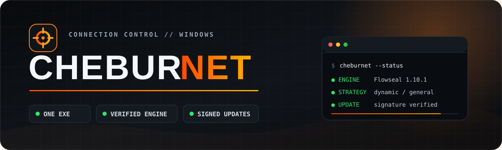
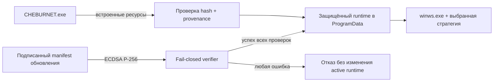
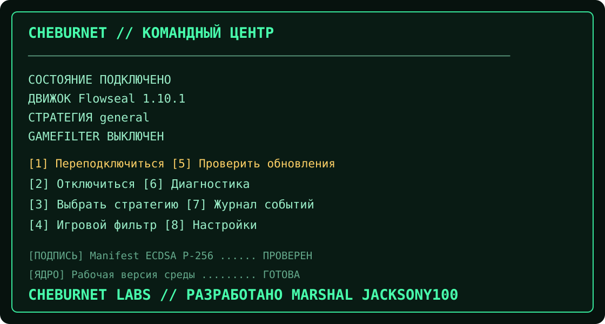

<div align="center">



<p><strong>Один EXE. Проверенный движок. Управляемый доступ.</strong></p>
<p>Консольный launcher для <code>winws</code> на Windows 10/11 x64<br>с динамическими стратегиями, безопасными обновлениями и откатом.</p>

[](https://github.com/Jacksony100/CHEBURNET/releases)
[](https://github.com/Jacksony100/CHEBURNET/actions/workflows/ci.yml)
[](#системные-требования)
[](LICENSE)

[Скачать RC](https://github.com/Jacksony100/CHEBURNET/releases/tag/v1.0.0-rc.1) · [Как запустить](#быстрый-старт) · [Безопасность](SECURITY.md) · [Документация обновлений](docs/UPDATE_SECURITY.md)

</div>

> [!IMPORTANT]
> Первый публичный выпуск имеет статус **Release Candidate**. Он прошёл чистую сборку, unit/integration-тесты и проверку fidelity, но ещё не объявлен стабильным до завершения интерактивного smoke-теста на чистых Windows 10 и 11 VM. EXE пока не имеет доверенной Authenticode-подписи — сверяйте SHA-256 с файлом из релиза.

## Зачем CHEBURNET

CHEBURNET упаковывает проверенный движок из
[Flowseal/zapret-discord-youtube](https://github.com/Flowseal/zapret-discord-youtube)
в понятный самостоятельный launcher. Пользователь скачивает только
`CHEBURNET.exe`: движок, WinDivert, списки и каталог стратегий уже встроены и
разворачиваются в защищённый versioned runtime.

| | Возможность | Что это даёт |
|---:|---|---|
| **01** | Один пользовательский EXE | Никаких архивов, ручной раскладки файлов и `.bat`-зоопарка |
| **02** | Динамический каталог стратегий | Launcher не предполагает фиксированное количество стратегий |
| **03** | Проверенный upstream | Версия и SHA-256 каждого embedded-файла фиксируются в provenance |
| **04** | Fail-closed обновления | Неверная подпись, hash, схема, путь или ACL всегда отменяют обновление |
| **05** | Versioned runtime и rollback | Новая версия ставится рядом; предыдущая остаётся известной рабочей |
| **06** | Privacy by design | Нет телеметрии, аналитики, сбора трафика и удалённой отправки логов |

> [!NOTE]
> CHEBURNET — **не VPN**. Он не создаёт зашифрованный туннель, не обеспечивает
> анонимность и не подменяет upstream-проекты.

## Быстрый старт

1. Скачайте `CHEBURNET.exe` и `CHEBURNET.exe.sha256` только со страницы
   [официального релиза](https://github.com/Jacksony100/CHEBURNET/releases/tag/v1.0.0-rc.1).
2. Проверьте файл в PowerShell:

   ```powershell
   Get-FileHash .\CHEBURNET.exe -Algorithm SHA256
   Get-Content .\CHEBURNET.exe.sha256
   ```

3. Запустите EXE и подтвердите настоящий запрос UAC. Права администратора нужны
   драйверу WinDivert для обработки сетевых пакетов.
4. Оставьте стратегию `general` или выберите другую, затем подключитесь.

Microsoft Defender и другие защитные продукты могут дополнительно проверять
WinDivert и DPI-инструменты. Не отключайте антивирус и не добавляйте исключения
как обычный шаг установки. Неожиданное срабатывание можно конфиденциально
сообщить по инструкции в [SECURITY.md](SECURITY.md).

## Как это устроено



Обновления принимаются только по HTTPS и только после проверки detached
ECDSA P-256 подписи встроенным публичным ключом. До доверия URL и контрольным
суммам manifest проходит строгую проверку схемы. Payload устанавливается
транзакционно, а работающий elevated launcher никогда не перезаписывает себя
на месте.

<p align="center">
  
</p>

## Возможности

- автоматическое обнаружение всех поддерживаемых upstream-стратегий;
- GameFilter: выключен, весь трафик, только TCP или только UDP;
- транзакционный запуск `winws.exe` с проверкой identity и стабилизации процесса;
- защищённое дерево `%ProgramData%\CHEBURNET`, атомарные записи и SHA-256;
- подписанные обновления launcher/payload с anti-downgrade и rollback;
- локальные диагностика, журнал и настройки без телеметрии;
- пути с пробелами и кириллицей, нативный Unicode-вывод консоли;
- C++20, static CRT, `/W4 /WX`, Control Flow Guard, DEP и ASLR.

## Данные на компьютере

```text
%ProgramData%\CHEBURNET\
  runtime\<engine-version>\  неизменяемые версии движка
  user\config.json           настройки
  user\lists\                пользовательские дополнения к спискам
  updates\                   staging проверенных обновлений
  logs\                      локальные журналы и диагностика
  active-runtime.json        текущее и предыдущее состояние
```

Если сеть или сервер обновлений недоступны, текущий known-good runtime
продолжает работать. Если не проходит хотя бы одна проверка подписи, SHA-256,
схемы, пути, ACL, пакета, процесса или здоровья — обновление отклоняется.

## Системные требования

- Windows 10 или Windows 11, x64;
- права администратора для запуска WinDivert;
- сетевой адаптер с доступом в интернет.

## Сборка и тесты

Потребуются Visual Studio Build Tools с MSVC x64 и CMake 3.25+:

```powershell
scripts\build-release.ps1 -BuildDir build
scripts\run-tests.ps1 -BuildDir build
scripts\package.ps1 -BuildDir build -OutDir dist -SkipBuild
```

Публичный RC проходит чистую сборку с `/W4 /WX`, **33 CTest-теста** и
**84 fidelity-проверки** стратегии/режима. Сценарий ручной проверки описан в
[docs/SMOKE_TEST.md](docs/SMOKE_TEST.md), модель доверия — в
[docs/UPDATE_SECURITY.md](docs/UPDATE_SECURITY.md).

## Удаление

Отключитесь, закройте CHEBURNET и удалите `%ProgramData%\CHEBURNET`.
Сам `CHEBURNET.exe` портативный и не регистрирует отдельный деинсталлятор.

## Авторы и лицензии

CHEBURNET поддерживается проектом
[Jacksony100/CHEBURNET](https://github.com/Jacksony100/CHEBURNET). Сетевой
движок поставляется из Flowseal `zapret-discord-youtube`, основанного на
`zapret/winws` bol-van, и включает WinDivert/Cygwin-компоненты. CHEBURNET не
присваивает авторство этих проектов.

Код launcher распространяется по MIT. Полные уведомления и тексты лицензий:
[THIRD_PARTY_NOTICES.md](THIRD_PARTY_NOTICES.md), [LICENSES/](LICENSES/),
[DEPENDENCIES.md](DEPENDENCIES.md). Политика приватности:
[docs/PRIVACY.md](docs/PRIVACY.md).

<div align="center">

**CHEBURNET** · connection control, built to fail closed

</div>
